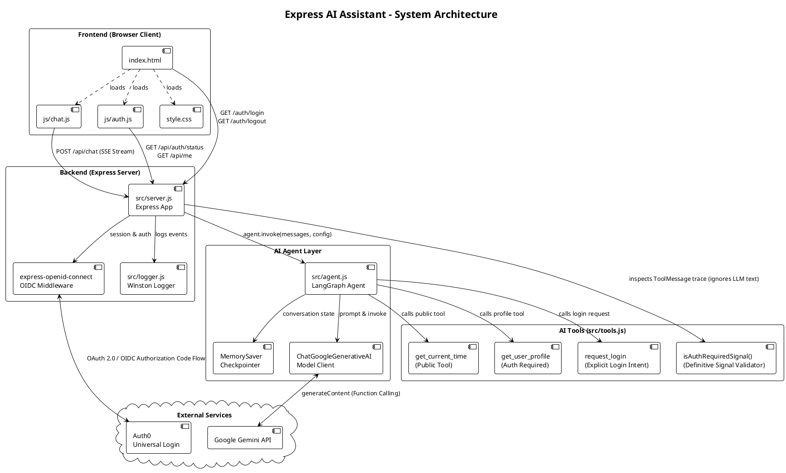
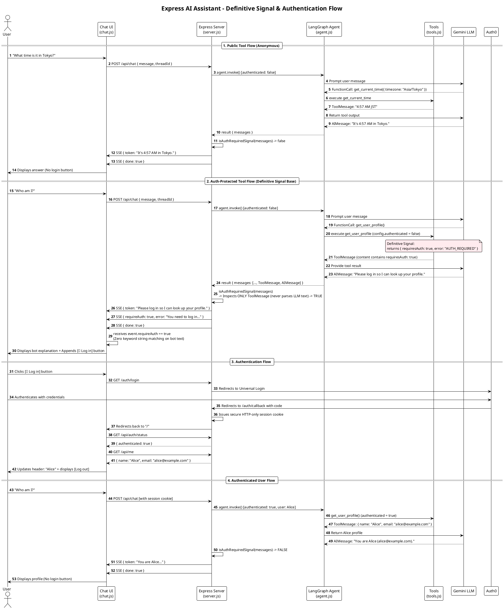

# Architecture Overview

This project is an AI assistant with a clean separation between frontend and backend, supporting both anonymous and authenticated users.



## Backend Structure (`src/`)

### `server.js` — Express server & routing
- **Entry point**: Runs on `http://localhost:3000`
- **Auth**: Auth0 integration via `express-openid-connect` (optional, not required for chat)
- **Key endpoints**:
  - `GET /` — Serves index.html (shows login or chat based on auth status)
  - `GET /api/auth/status` — Returns `{authenticated: boolean}`
  - `GET /api/me` — Returns user profile (requires login)
  - `POST /api/chat` — Streams chat responses as Server-Sent Events
    - Works for **both anonymous and authenticated users**
    - Passes `authenticated` flag to agent so tools can check auth status

### `agent.js` — LangGraph ReAct agent
- Uses `createReactAgent` from LangGraph (ReAct = Reasoning + Acting pattern)
- Model: Google Gemini
- Checkpointer: In-memory (use Postgres/Redis for production)
- System prompt: Friendly, concise personal assistant

### `tools.js` — AI tools
- **`get_current_time(timezone?)`** — Public tool, works for all users
- **`get_user_profile()`** — Auth-required, throws error if `authenticated === false`

## Frontend Structure (`public/`)

### `index.html` — Single page, two screens
- **Login screen**: Shows for non-authenticated users (or if not in anonymous mode)
  - "Log in" button
  - "Sign up" button
  - "Start chatting anonymously" link
- **Chat screen**: Shows for all users (authenticated or anonymous)
  - Header with user name (shows "Guest" for anonymous)
  - Chat log (messages)
  - Input form
  - New chat button
  - Log out button (only for authenticated users)

### `js/auth.js` — Authentication UI logic
- Checks `/api/auth/status` on page load
- Fetches `/api/me` if authenticated
- Stores auth state in `AUTH` object
- Handles anonymous mode toggle
- Renders login or chat screen based on auth state

### `js/chat.js` — Chat messaging logic
- Manages thread ID (UUID, persisted per browser session)
- Sends messages to `/api/chat` endpoint
- Streams Server-Sent Events (SSE) responses
- Displays tool usage (e.g., "🔧 using get_current_time…")
- Handles auth errors gracefully:
  - If tool requires auth, shows login prompt to user
  - User can click "Log in" to proceed

### `style.css` — Styling
- Dark/light mode support (system preference)
- Mobile-responsive layout
- Clean, minimal design

## Data Flow



### Anonymous Chat Flow
```
User → "What time is it?" 
  → POST /api/chat (no auth header)
  → Agent runs (authenticated = false)
  → Agent calls get_current_time (public tool)
  → Response streamed to UI
  → User sees answer
```

### Authenticated Chat Flow
```
User → Login (Auth0)
  → GET / (redirects to chat.html)
  → GET /api/auth/status (returns authenticated: true)
  → GET /api/me (shows user name)
  → "Who am I?"
  → POST /api/chat (with session)
  → Agent runs (authenticated = true)
  → Agent calls get_user_profile
  → Response streamed to UI
  → User sees their profile
```

### Auth Error Flow (Definitive Signal Base)
```
Anonymous user → "Who am I?"
  → POST /api/chat (no auth)
  → Agent runs (authenticated = false)
  → Agent invokes get_user_profile tool
  → Tool returns structured auth-required payload: { requiresAuth: true, error: "AUTH_REQUIRED" }
  → Server checks tool trace with isAuthRequiredSignal (never parses LLM text)
  → Server streams assistant explanation + SSE event: { requireAuth: true }
  → UI displays assistant message and appends "🔐 Log in" button based on signal
  → User clicks button → redirects to /auth/login
```

## Key Design Decisions

1. **No React** — Vanilla JavaScript keeps the codebase simple and dependency-free
2. **Anonymous-first** — Users can chat immediately without login
3. **Gradual authentication** — Only ask for login when a feature needs it
4. **Separation of concerns**:
   - `auth.js` handles auth UI
   - `chat.js` handles chat messaging
   - `server.js` handles API routing
   - `tools.js` handles AI tool definitions
   - `agent.js` handles AI agent configuration
5. **Server-Sent Events** — Streams token-by-token responses for real-time feel
6. **Thread persistence** — Each browser session gets a UUID, conversations persist within that session

## Deployment Checklist

- [ ] Replace `MemorySaver()` checkpointer with persistent store (Postgres, Redis, etc.)
- [ ] Set `APP_BASE_URL` to production domain
- [ ] Ensure Auth0 credentials are set in environment
- [ ] Consider rate limiting on `/api/chat` endpoint
- [ ] Add CORS if frontend and backend are on different domains
- [ ] Monitor LLM token usage and costs
